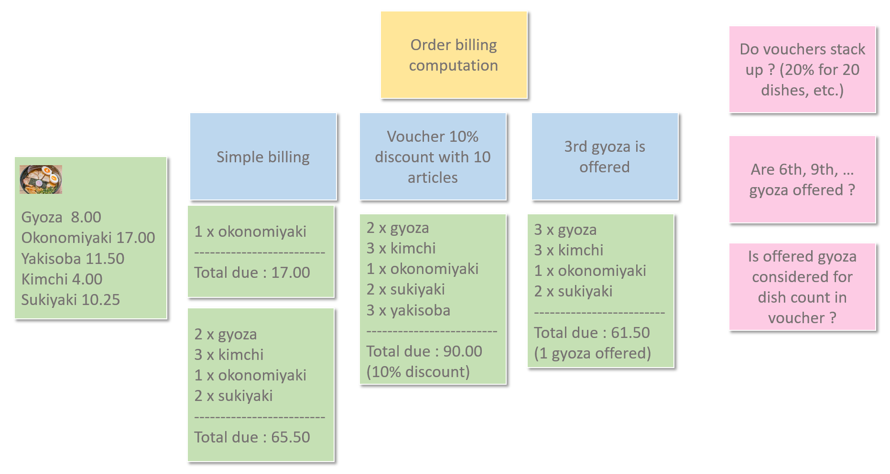
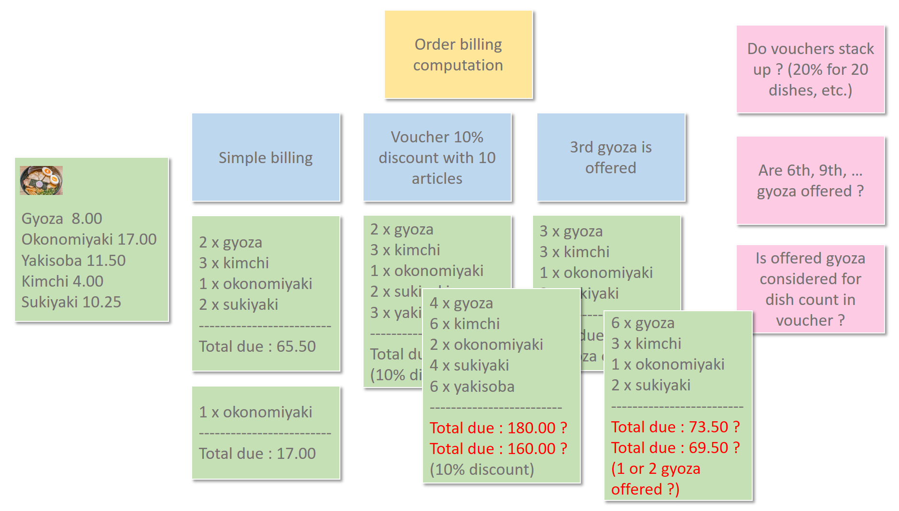

# cucumber-kimchi
Simple implementation of asian restaurant order billing specification with Cucumber

## Exploration time

After chatting with the domain expert, we list the following main features:


Since the features are not very clear, we organize an example mapping session, providing this output :



Some questions are still unanswered, so we provide alternative expected results for ambiguous examples:



## Formulation time

We propose the following Gherkin formulation for one of our first examples:

```gherkin
Feature: Order billing computation
	To allow a customer to order some dishes and compute his/her bill.

	Scenario: Order some dishes an compute the order amount
		Given the menu contains the following dishes
			| name        | price |
			| gyoza       | 8.0   |
			| okonomiyaki | 17.0  |
			| yakisoba    | 11.50 |
			| kimchi      | 4.0   |
			| sukiyaki    | 10.25 |
		And the customer ordered 2 "gyoza"
		And  the customer ordered 3 "kimchi"
		And  the customer ordered 1 "okonomiyaki"
		And  the customer ordered 2 "sukiyaki"
		When the waiter computes the bill
		Then the bill amount should be "65.50"
```

## Automation time

The goals of the kata are to:
* automate the first provided scenario
* formulate, then automate, the next scenarios to cover the various examples and business rules discussed in the Example Mapping session
* try to provide an implementation as much domain-oriented as possible
